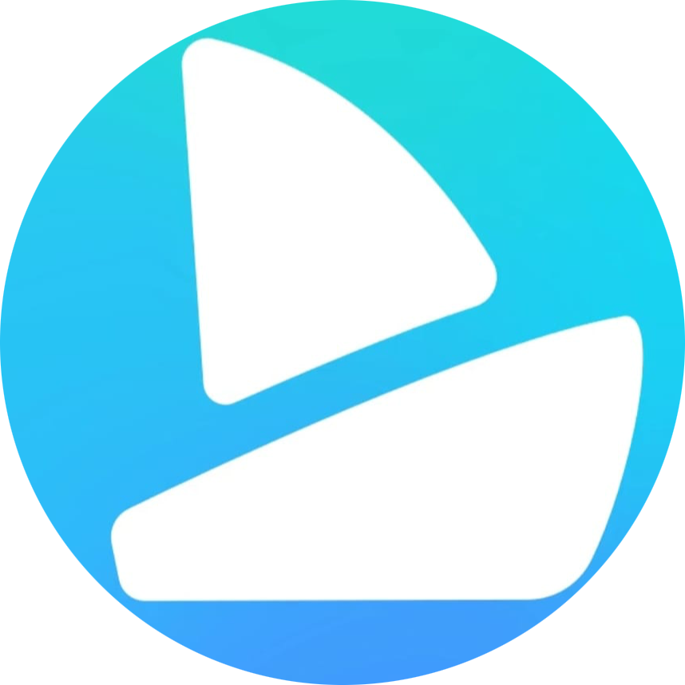
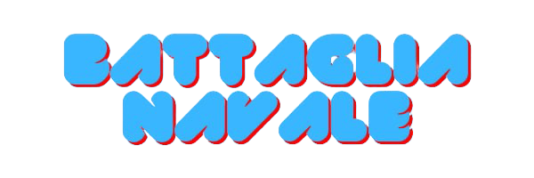
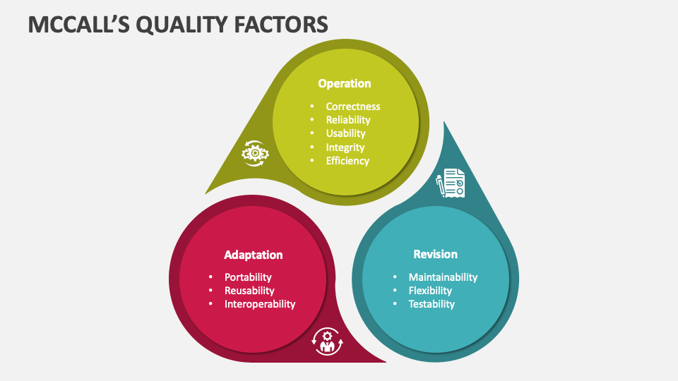

  
   

# Progetto di ingegneria del software
### Anno accademico 2023-2024

### Membri del team
- Buscaglia Giacomo, matricola 1078804
- Ciancio Luca, matricola 1079291
- Gervasoni Federica, matricola 1078966
- Signori Giulia, matricola 1078801

## Indice
- __0. Il progetto__
- __1. Project plan__
  - 1.1 Introduzione
  - 1.2 Modello di processo
  - 1.3 Organizzazione del progetto
  - 1.4 Standards, linee guida e procedure
  - 1.5 Attività di gestione
  - 1.6 Rischi
  - 1.7 Membri
  - 1.8 Metodi e tecniche
  - 1.9 Garanzie di qualità
  - 1.10 Package di lavoro
  - 1.11 Risorse
  - 1.12 Budget e pianificazione
  - 1.13 Cambiamenti
  - 1.14 Consegna
- __2. Software lifecycle__
- __3. Configuration Management__
  - 3.1 Struttura del progetto
  - 3.2 Issues e Kanban Board
- __4. People Management__
- __5. Software Quality__
- __6. Requirement Engineering__
  - 6.1 Specifica dei Requisiti
    - 6.1.1 Schermata Iniziale e Accesso
    - 6.1.2 Scelta Metodologia di Gioco
    - 6.1.3 Posizionamento
    - 6.1.4 Gioco
  - 6.2 Moscow
  - 6.3 Kano
- __7. Modelling__
    - 7.1 Diagramma di Stato
    - 7.2 Diagramma di Sequenza
    - 7.3 Diagramma di Attività
    - 7.4 Diagramma dei Conponenti
    - 7.5 Diagramma di Stato
- __8. Software Architecture__
  - 8.1 Struttura MVC
  - 8.2 Structure 101
- __9. Software Design__
- __10. Softare Testing__
- __11. Software Refactoring__
- __12. Software Maintenance__

  
## Il progetto
Realizzazione in Java del gioco Battaglia Navale, realizzato in due differenti modalità: multiplayer online e giocatore singolo contro la CPU. 

### Guida rapida al gioco
#### Scopo del gioco
Lo scopo del gioco è localizzare tutte le unità della flotta navale nemica composta da diverse navi, in tutto 10: 
-1 portaerei da 4 caselle  
-2 incrociatori da 3 caselle  
-3 cacciatorpedinieri da 2 caselle  
-4 sottomarini da 1 casella.  
Le navi non si possono toccare e possono essere disposte solo in orizzontale ed in verticale. 

#### Svolgimento del gioco
I giocatori devono posizionare le proprie navi sulla propria griglia, composta da 10 righe e da 10 colonne. Una volta posizionate le navi, il gioco procede a turni.
Il giocatore di turno "spara un colpo" selezionando sulla griglia dell'opponent la casella che si vuole colpire (la quale ha una specifica coordinata).
Nel momento in cui il colpo va a segno, cioè il gioocatore ha colpito oppure affondato una nave, il turno non viene passato ed il giocatore può tentare un altro colpo. 
Altrimenti, se il colpo non va a segno, il turno viene passato al giocatore avversario. 
A vincere è il primo giocatore che affonda tutte le navi dell'avversario.

## 1. Project plan
https://github.com/buscst/BattagliaNavaleIngSoftware2324/blob/main/docs/Project%20Plan.md

## 2. Software lifecycle

Per il processo di sviluppo del gioco si è deciso di sfruttare un approccio di tipo *agile*, in particolare abbiamo deciso di seguire i principi del modello RAD, Rapid Application  Development.  
I principi sui quali ci siamo basati sono:
- L'organizzazione del team ha seguito i principi della SWAT: i 4 membri hanno avuto la stessa importanza e non ci sono state gerarchie all'interno del team, che ha lavorato in modo coeso e collaborando nelle diverse fasi dello sviluppo.  
- Le riunioni del gruppo sono state brevi sessioni, prevalentemente di brain storming, o nelle quali si cerca una soluzione ad un problema rilevato durante i test, che sono stati svolti ripetutamente e a seguito di ogni cambiamento. La documentazione di queste riunioni  è minima, formata principalmente da appunti o da schemi sui quali basarci per le future implementazioni e modifiche da attuare.  
Qualora non fosse stato possibile incontrarsi dal vivo, le riunioni sono state eseguite attraverso videochiamate da remoto, tramite applicazioni apposite quali *Google Meet* o *Discord*. 
-	Abbiamo usato cicli di sviluppo piccoli ed incrementali; lo sviluppo viene pianificato man mano senza una pianificazione eccessivamente anticipata, data l'assenza di esperienze pregresse sulle quali basarci. Ogni volta che un membro apportava modifiche al progetto lo comunicava agli altri membri, nel caso fosse necessario anche attraverso issues.  
- Il team ha preso anche spunto dai principi dell'*extreme programming*, basandosi sul concetto di voler creare un software funzionante e di qualità, dando importanza: prima al portare a termine i punti di must have del progetto, poi al migliorarli fino all'ottenimento di un progetto che fosse ritenuto di buona qualità e infine alle possibili implementazioni da attuare nel tempo rimanente.
- Durante lo sviluppo, sopratttutto nei momenti iniziali, si è sfruttato spesso il *pair programming* come metodo di verifica: abbiamo lavorato in coppia  sullo stesso frammento di codice in modo tale da avere una verifica in tempo reale sul lavoro svolto. Questa pratica ha inoltre favorito lo scambio di idee e la ricerca di soluzioni migliori, fondamentale nei primi incontri.
- Durante lo sviluppo abbiamo fruttato la tecnica del *timeboxing* tipica dello sviluppo RAD assegnando ad ogni compito una scadenza entro la quale doveva essere portato a termine.
- Sempre seguendo il principio di RAD abbiamo eseguito un triage dei requisiti secondo il metodo Moscow durante la fase iniziale. 

## 3. Configuration management
Tutto il lavoro svolto, che si tratti di documentazione o di codice, viene regolarmente salvato nel repository di GitHub.

### 3.1 Struttura del progetto
Il repository è strutturato nel seguente modo:
 - __branches__:
   - *main*: Contiene le versione alpha del codice
   - *beta*: Contiene la versione beta del codice (su questo branch sono state eseguite la maggior parte delle azioni)
 - __cartelle__:
    - *code*:
    - *docs*: Contiene la documentazione del progetto

Durante lo sviluppo del progetto sono stati creati diversi branch a partire dal master per implementare modifiche o per correggere errori quando riscontrati. 
Al termine dell'implementazione di tali modifiche, previa revisione di qualche altro componente delle modifiche eseguite attraverso una pull request, è stato effettuato il merge al branch master.

### 3.2 Issues e Kanban Board
Per la comunicazione e per l'aggiornamento sull'avanzamento dello sviluppo del lavoro il team ha utilizzato gli issues di GitHub.  
Come obiettivo del gruppo c'è stato l'impegno nell'utilizzo di questi come mezzo di comunicazione e di segnalazione degli avanzamenti o possibili problematiche; ogni membro ha la possibilità di creare nuovi issues nel caso lo trovasse necessario.  
Gli issues sono stati utilizzati anche all'interno della Kanban Board, utilizzata per monitorare le attività del team e come strumento di gestione.  
Per ogni issue della board è stata fatta una breve descrizione ed è stato designato un membro (o più) al quale assegnarlo.
Gli issues sono suddivise in 3 categorie principali:
- *task*: attività da svolgere
- *bug*: segnalazione di un bug
- *enhancement*: proposta di miglioramento
  
A seconda del loro avanzamento, i task possono trovarsi in diversi stati.
Gli stati sono i seguenti:
- *Todo*: L'attività non è ancora stata iniziata
- *In progress*: L'attività è in fase di sviluppo
- *Review*: L'attività è stata completata e deve essere testata
- *Done*:L'attività è stata completata e funziona correttamente
- *To fix*: L'attività è stata testata ma non funziona correttamente

## 4. People management
Abbiamo deciso di basarci su una struttura organizzativa non gerarchica, così da garantire una maggiore flessibilità e un più facile adattamento alle esigenze del progetto.  
La suddivisione del lavoro non è stata rigida, il team ha deciso di comune accordo come dividere e assegnare i vari task e, in caso di difficoltà, più membri si sono affiancati per risolvere la problematica in gruppo. Il vantaggio di questa scelta è stato anche di avere un clima più sereno e informale, utile per il benessere dei membri del team. 

Anche se non esite una distinzione tra i ruoli scritta, le diverse fasi del progetto sono state affrontate con più o meno partecipazione. Con la seguente tabella abbiamo riassunto le varie aree di competenza e come i membri del gruppo vi hanno partecipato. 

È bene sottolineare che, essendo il team composto da pochi membri, ogni componente ha partecipato attivamente ad ogni attivita seppur con differente obiettivo.

<table>
    <tr>
        <th></th>
        <th>Documentazione</th>
        <th>UML</th>
        <th>Progettazione</th>
       <th>Server</th>
       <th>Client</th>
        <th>Sviluppo back-end</th>
        <th>Sviluppo front-end</th>
        <th>Test</th>
    </tr>
    <tr>
    <th>Giacomo Buscaglia</th>
    <td>✅</td>
    <td>✅</td>
    <td>✅</td>
    <td>✅</td>
    <td>✅</td>
      <td>✅</td>
    <td>✅</td>
    <td>✅</td>
    </tr>
    <tr>
    <th>Luca Ciancio</th>
    <td>✅</td>
    <td>✅</td>
    <td>✅</td>
    <td>✅</td>
    <td>✅</td>
    <td>✅</td>
    <td>✅</td>
    <td>✅</td>
    </tr>
    <tr>
    <th>Federica Gervasoni</th>
    <td>✅</td>
    <td>✅</td>
    <td>✅</td>
    <td>✅</td>
     <td>✅</td>
    <td>✅</td>
    <td>✅</td>
    <td>✅</td>
    </tr>
    <tr>
    <th>Giulia Signori</th>
    <td>✅</td>
    <td>✅</td>
    <td>✅</td>
    <td>✅</td>
    <td>✅</td>
    <td>✅</td>
    <td>✅</td>
    <td>✅</td>
    </tr>
</table>

## 5. Software quality
Come precedentemente specificato, il team si è prefissato di sviluppare un'applicazione che rispetti i parametri e gli attributi di qualità, In particolare il team si è impegnato per rispettare i requisiti di qualità tassonomici di McCall. Illustriamo gli attributi di qualità che descrivono il nostro sistema attraverso la suddivisione effettuata da McCall,  quale suddivide gli attributi di qualità legati alla produzione, revisione e transizione del codice. 

 
  
 
1.Per quanto riguarda la produzione del codice e l'utilizzo del software una volta effettuata la consegna, ci aspettiamo le seguenti qualità:
- **Correttezza** : il software consegnato soddisfa i requisiti ed è stato sviluppato correttamente
- **Affidabilità** : il software è affidabile in quanto è stato testato più e più volte, ed è stato conseganto col minor numero di bug possibili, il software svolge le funzioni richieste in modo corretto
- **Efficienza** : per il funzionamento del software non è necessario l'uso di particolari risorse 
- **Integrità** : il software permette l'accesso ai soli utenti che hanno effettuato la registrazione e sono inseriti nel database
- **Usabilità** : il prodotto è semplice da utilizzare infatti non sono richieste, oltre che a risorse avanzate, nemmeno competenze e conoscenze particolari. Il team si è posto l'obiettivo di fornire una grafica semplice ed intuitiva.  
L'interpretazione dell'output e l'immissione dell'input è facilitata dalla presenza di un Tutorial iniziale che è possibile consultare ogni volta che si apre il menu principale  

2.Rispetto alla manutenibilità e all'interazione con l'ambiente, ci aspettiamo che rispetti le seguenti qualità:
- **Testabilità**: le funzionalità incluse sono testabili in qualunque momento tramite test manuali implementati attraverso l'utilizzo di JUnit
- Manutenibilità: il software è stato sviluppato con l'obbiettivo di essere chiaro, cosi da permettere l'individualizzazione e la risoluzione di eventuali errori. A questo fine il team si è impegnato a eseguire una suddivisione del codice nelle diverse parti: il server ed il client sono divisi e inoltre vi è una distinzione tra le classi di logica, di modello e di interfaccia che permette una gestione migliore del codice.
- **Flessibilità**: il software si presenza incline all'implementazione di nuove funzionalità
- **Riusabilità**: Sono state sfruttate e scritte librerie che possono essere riutilizzate in altri ambiti in quanto sono state sviluppate in modo indipendente dal contesto del gioco.  
3. Infine,in riferimento alle qualità legate alla transizione del codice distinguiamo le qualità di:
- **Portabilità**: Il gioco è eseguibile sui più diffusi sistemi operativi desktop (Windows, Linux, MacOS) dotati di una connessione internet.
- **Riusabilità**: il codice è stato scritto in modo modulare, per poter essere riutilizzabile in futuro.
 

## 6. Requirement Engineering
I requisiti sono stati decisi in fase di elicitazione, durante la quale abbiamo utilizzato linguaggio formali e semiformali, cioè la descrizione in linguaggio naturale e la descrizione degli scenari attarverso diagrammmi UML (ad esempio lo use case lo abbiamo utilizzato per comprendere come l'utente potesse interagire col sistema). Abbiamo quindi redatto, a partire dai requisiti elicitati un documento identificato come Specifica dei Requisiti, il quale è stato alla base dell'attività di Validazione, necessaria per capire se stessimo costruendo nel modo giusto il nostro sistema.   
Di seguito sono riportati i requisiti che costituiscono i Must Have del progetto, nel dettaglio.

### 6.1 Specifica dei Requisiti
#### 6.1.1 Schermata Iniziale e Accesso
* La schermata iniziale è quella per l'accesso, che si distingue in due modalità: attraverso Login o Registrazione.  
* Un cliente che non è loggato può registrarsi inserendo il suo nome, il cognome, un username (il quale vogliamo che sia univoco) ed una password. Queste informazioni vengono salvate nel database e vengono poi verificate ogni volta che un utente esegue il login (con username e password).  
* Il login ha successo solo nel momento in cui l'username inserito ha un riscontro nel database.  
* L'username è l'identificativo del client nel gioco multiplayer, si eseguono controlli durante il collegamento al server per verificare che il gioco avvenga sempre tra username diversi.  

#### 6.1.2 Scelta Metodologia di Gioco
* Una volta eseguito l'accesso si apre la schermata del menu principale, questa offre diverse opzioni: deve essere presente l'opzione di visualizzazione del Tutorial, così che l'utente inesperto possa apprendere ad utilizzare il gioco.  
* Il gioco è solo orientato alla versione multiplayer, che può essere eseguita in due modi diversi:
- in locale su uno stesso pc
- su pc diversi connessi alla stessa rete locale
 

#### 6.1.3 Posizionamento
* Una volta eseguito l'accesso e decisa la modalità di gioco, si apre una schermata di attesa. Questa rimane visibile fino al momento in cui non si connette al server un secondo client (il quale deve avere un username diverso dal primo). 
* Una volta connessi due client al primo dei due si apre la griglia di gioco, mentre il secondo rimane in attesa che il primo effettui il posizionamento delle barche nella griglia.  
* Il posizionamento delle barche inizia con la scelta della barca, una volta selezionata questa viene tolta dal pannello sottostante alla griglia e va posizionata in un punto.   
* Non deve essere possibile selezionare due barche di fila in questo momento.  
* Supponiamo che il primo click che si effettua sulla griglia inidichi un estremo della barca. 
* Una volta iniziato il posizionamento della barca, se questa non è una barca da uno, viene calcolato dal server se la posizione scelta è corretta e viene mostrato sulla griglia come poter terminare il posizionamento.  
* In questo momento sono stati gestite le varie eccezioni, così che non si possa cliccare qualcosa che non sia suggerito.  
* In caso di errore di posizionamento la barca deve tornare visibile nella zona sottostante.  
* Una volta terminato il posizionamento del primo client può iniziare il secondo, il quale viene risvegliato dal server.  

#### 6.1.4 Fase di Gioco
* Terminati i posizionamenti delle barche, il turno deve passare a colui che si era connesso per primo.  
* In questa fase la mia grilia non deve essere cliccabile, così come la grilia dell'avversario quando non è il mio turno  
* Deve essere presente un pannello che indichi quando è il turno del client
* Il client ora deve cercare di colpire una barca dell'avversario cliccando sulla griglia alla sua destra.  
* Cliccata una cella bisogna verificare quale sia il suo stato nella griglia dell'avversario e settare la cella in base a questo:
* * se la cella cliccata contiene una barca di lunghezza 1 la cella diventa nera perchè affondata
  * se la cella cliccata contiene una barca di lunghezza maggiore di 1 diventa colpita, si effettua il controllo sullon stato delle caselle della barca, se sono tutte colpite allora la barca diventa affondata
  * se la cella colpita non contiene barche diventa blu, indicando che è stata colpita l'acqua
* Quando sono state affondate tutte le barche il gioco termina e compare la schermata finale
* Dalla schermata finale posso tornare al menu per giocare ancora oppure uscire dal gioco

## 6.2 Moscow 
I requisiti specificati nel punto 6.1 sono quelli che abbiamo concordato essere necessari per la buona riuscita del gioco, quindi i Must Have del nostro sistema.  
Seguendo la classificazione Moscow, come già anticipato nel project plan, abbiamo etichettato anche altri vari requisiti, giudicati dal team come non fondamentali. 
### 6.2.1 Should Have
I requisiti ritenuti importanti ma non necessari, i quali abbiamo deciso di lasciare alla fine nel caso fosse stato possibile implementarli nel tempo a disposizione sono:
* Visualizzazione di una classifica generale degli utenti tenendo in considerazione delle vittorie e delle sconfitte
* Implementazione di suoni interattivi durante il gioco, e come sottofondo. Ad esempio associare un suono all'esito del colpo.
* Rendere possibile la connessione di più di due giocatori per permettere di giocare un torneo invece che singole partite
* Inserire un tutorial che aiuti la comprensione del gioco e migliori l'usabilità
* Permettere la scelta della lingua delle schermate iniziali attarverso un bottone nella GUI
### 6.2.2 Could Have
I requisiti ritenuti come secondari ed omettibili, si trovano tra i could have. Non sono stati implementati e vengono lasciati come requisiti futuri, implementabili in versioni successive del gioco:
* Rendere le navi più grafiche attraverso l'utilizzo di icone, le quali possono essere modificate dall'utente
* Possibilità di scegliere il livello di difficoltà del gioco, inteso come grandezza della griglia sulla quale posizionare le navi
* Implementazione gioco single Player contro la CPU
* Animazioni grafiche
### 6.2.3 Won't
I requisiti Won't sono quei requisiti che dal principio reputavamo non implementabili in questa versione del gioco. Tra questi:
* Applicazione Mobile
* Web App
* Potenziamento colpi con sistema shop che permetta ad esempio di affondare direttamente una barca quando la si colpisce
## 6.3 KANO
Il modello Kano dei requisiti è un approccio utilizzato per classificare e comprendere le preferenze dei clienti riguardo ai requisiti dei prodotti o dei servizi. Si basa sull'idea che non tutti i requisiti hanno lo stesso impatto sulla soddisfazione del cliente e che alcuni requisiti possono essere considerati fondamentali mentre altri sono visti come vantaggi aggiuntivi.  

Il modello Kano identifica tre categorie principali di requisiti:

- Requisiti *must have*: Questi sono i requisiti essenziali che i clienti danno per scontati. La mancanza di tali requisiti può portare a una significativa insoddisfazione del cliente, la loro soddisfazione invece porta il cliente ad una situazione di nautralità per la soddisfazione.

- Requisiti *unidimensionali*: Questi sono i requisiti che aumentano linearmente la soddisfazione del cliente in base al loro livello di soddisfazione. Maggiore è il livello di soddisfazione di questi requisiti, maggiore sarà la soddisfazione complessiva del cliente.
  
- Requisiti *attraenti*: Questi sono i requisiti che sorprendono e deliziano i clienti, anche se non sono necessari. Aggiungono un valore aggiunto al prodotto o al servizio e possono differenziarlo dalla concorrenza. La loro mancata soddisfazione non porta insoddisfazione al cliente.
  
## 7. Modelling
Durante lo sviluppo del software abbiamo utilizzato dei diagrammi UML per la descrizione del sistema e di alcune sue parti. 
### 7.1 Diagramma dei casi d'uso
Utlizzato in una fase iniziale di ingegneria dei requisiti per capire come il cliente potesse interfacciarsi al sistema, la sua stesura ha aiutato a comprendere come sviluppare il sistema e a quali parti dare maggior rilevanza.

  
### 7.2 Diagramma di sequenza

  
 
### 7.3 Diagramma delle attività

  
 
### 7.4 Diagramma dei componenti

  
 
### 7.5 Diagramma di stato

  

 
## 8. Software Architecture
### 8.1 Struttura MVC
Il software abbiamo deciso di basarlo sullo stile architetturale MVC (Model-View-Control):
-VIEW: la view è l'insieme delle gui che gestiscono l'interfaccia utente e attraverso le quali vengono inseriti gli input. Attraverso l'interfaccia l'utente durante il gioco manipola i dati. Tale manipolazione è realizzata del Control. (Ad esempio attraverso i click sulla caselle della griglia cambio lo stato della griglia.)
-MODEL: rappresenta i dati e gestisce le loro modifiche. Il model gestisce poi la visualizzazione dell'interfaccia utente attraverso il controller.
 
Esempio di utilizzo di MVC nel progetto: 
durante il gioco un utente prova a colpire una barca dell'avversario sulla griglia a destra. L'utente cliccando da un input al programma che viene elaborato attraverso le classi di logica del control. Queste comunicano con il socket e verificano lo stato della casella. Nel momento in cui la casella viene controllata possiamo dire che lo stato della cella cambia. Può essere parte di una barca e quindi identificare che la barca è stata colpita, oppure che la barca è stata affondata. Lo stato della casella è all'interno del model e viene modificato dal control. Una modifica del model porta ad una modifica della View infatti la casella a seconda del suo stato cambia colore. 
### 8.2 Structure 101

Durante la fase di implementazione e nella fase di refactoring abbiamo utilizzato Structure 101.  
Structure101 è uno strumento di analisi e gestione della complessità del software. Esso fornisce una panoramica dettagliata dell'architettura del software, identificando dipendenze indesiderate, violazioni di regole di progettazione e altri problemi che possono compromettere la manutenibilità e la scalabilità del sistema nel tempo.
Durante la fase di implementazione e nella fase di refactoring abbiamo utilizzato Structure 101
Abbiamo, durante il refactoring, come spiegato al punto [11](https://github.com/buscst/BattagliaNavaleIngSoftware2324/edit/main/docs/Documentazione.md#11-refactoring) cercato di migliorare alcuni aspetti del codice,basandoci sulle percentuali fornite da Structure 101.  
Attraverso l'implementazione di Structure 101 abbiamo notato che il codice presentava una percentuale di grasso troppo elevata e che quindi andava a nuocere alla qualità del sistema rendendolo meno manutenibile, più difficilmente testabili e meno comprensibile.  
Abbiamo quindi decomposto le funzioni di modo che fossero meno ingombranti, e abbiamo raggiunto una percentuale di grasso pari a 0.

## 9. Software Design
All'interno del nostro sistema abbiamo utilizzato diversi pattern a fronte di alcune problematiche: 
**1.Singleton**
Abbiamo utilizzato il pattern Singleton all'interno del server affinchè non fosse possibile istanziare, all'interno delle altre classi, la classe Singleton in modo ripetuto.  Attraverso il metodo *getInstance* del Server infatti facciamo in modo che ogni richiesta di istanziazione, qual'ora l'istanza del server non fosse nulla, si limiti alla sola restituzione dell'istanza già presente piuttosto che alla creazione di un'ulteriore istanza della classe Server. 
**2:Observer**
**3.Delegator**???

## 10. Software Testing
Durante lo sviluppo il corretto funzionamento del codice è stato testato costantemente con test pratici di esecuzione del programma e delle sue funzionalità. Questo è stato effettuato inserendo controlli di stampa,debug con break point e attraverso test di JUnit.  
Nel momento in cui ci si è trovavi davanti un errore si è proceduto alla sua correzione, nel caso chiedendo anche agli altri membri un aiuto. 
In seguito alla revisione del bug e del codice errato si è poi ripetuto il test per verificarne l'esito.  
In alcuni casi, insieme alla correzione del bug è stato necessario fare anche delle modifiche più sostanziali al programma con un conseguente refactoring del codice per adattarlo alle nuove funzionalità. Queste modifiche essendo più invasive hanno spesso richiesto la creazione di un branch sul quale effettuare il lavoro.  

## 11. Software Refactoring

Il refactoring è un processo fondamentale nel ciclo di vita del software, in cui il codice viene esaminato e ottimizzato senza aggiungere nuove funzionalità, ma piuttosto migliorando la sua struttura interna per eliminare inefficienze, ridurre la complessità e migliorare la leggibilità e la manutenibilità nel tempo.
Il team ha dedicato parte del suo tempo, soprattutto nella fase finale dello sviluppo, all'analisi del codice alla ricerca di aspetti migliorabili, tra questi:
-> eliminazione utilizzo improprio della gerarchia delle classi
-> evitare l'assenza di commenti per rendere più chiaro il codice e quindi più comprensibile e manutenibile
-> miglioramento della coesione e diminuzione dell'accoppiamento
-> eliminazione di elementi che ostacolino il cambiamento
-> ristrutturazioni delle classi qualora fossero troppo grandi: se una classe diventa troppo complessa o ha troppe responsabilità, può essere utile suddividerla in classi più piccole e coese. Questo favorisce una migliore organizzazione del codice e una maggiore facilità di manutenzione.
-> rinominazione variabili e metodi al fine di migliorare la comprensione del codice 
-> decomposizione di lunghe funzioni le quali possono essere difficili da comprendere e testare. Suddividere queste funzioni in sottofunzioni più piccole, ognuna con una singola responsabilità, rende il codice più chiaro e facilita la verifica e la manutenzione.
-> utilizzo di design pattern per migliorare la struttura e l'organizzazione del codice

Per verificare che il lavoro di refactoring, l'evoluzione del codice ed il miglioramento delle metriche, abbiamo utilizzato Structure 101.

## 12. Software Maintenance
La manutenzione di un software rappresenta un processo fondamentale nell'assicurare il suo funzionamento ottimale e la sua continua adattabilità alle mutevoli esigenze degli utenti e dell'ambiente in cui opera. Tale processo si articola in diverse tipologie di intervento: la manutenzione correttiva, volta alla risoluzione tempestiva di errori e malfunzionamenti; la manutenzione adattiva, che si occupa di aggiornare il software per adeguarlo a modifiche nell'ambiente operativo o nei requisiti di sistema; la manutenzione perfettiva, finalizzata a implementare nuove funzionalità richieste dagli utenti o a ottimizzare le prestazioni dell'applicativo; infine, la manutenzione preventiva, che mira a prevenire futuri problemi e a migliorare la manutenibilità complessiva del software.

Nel contesto di un software sviluppato seguendo il paradigma COTS (Commercial Off The Shelf), nel quale ci troviamo col nostro software il quale non ha un committente diretto, la manutenzione perfettiva assume un ruolo particolarmente rilevante. Contrariamente ai progetti su commissione, in cui le richieste di miglioramento provengono direttamente dal committente, nel caso dei software COTS, tali miglioramenti sono spesso determinati da cambiamenti nel mercato o dalle esigenze emergenti della vasta comunità di utenti. Pertanto, la capacità di rispondere prontamente a tali evoluzioni diventa cruciale per mantenere la rilevanza e la competitività del software nel tempo.

La fase di manutenzione ha inizio sin dal momento della consegna dell'applicativo e si protrae per l'intera durata della sua vita utile. Questo implica un impegno continuo nell'aggiornamento, nell'ottimizzazione e nell'espansione delle funzionalità del software al fine di garantirne l'efficacia e la soddisfazione degli utenti nel lungo periodo.

